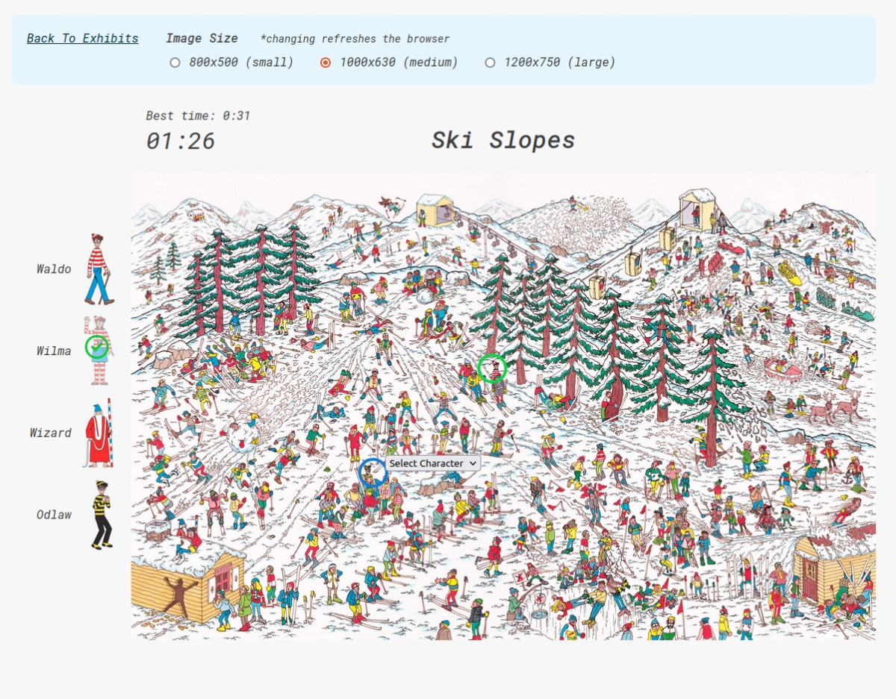

# Where's Waldo

Where's Waldo is an interactive browser adaptation of the classic puzzle books. Players search detailed illustrated scenes to locate familiar characters while competing for the fastest completion time.

Originally developed as part of The Odin Project's Ruby on Rails curriculum, the project provided hands-on experience integrating JavaScript into a Rails application, handling asynchronous client-server communication with AJAX, and building an interactive game interface.

## Features

- Three exhibits with increasing difficulty.
- Displays each exhibit's name, difficulty, and best completion time.
- Tracks completion time with an in-game timer.
- Three selectable image sizes for improved accessibility on different screen sizes.
- Visual checklist showing which characters have already been found.
- Interactive character selection with immediate visual feedback for correct and incorrect guesses.
- Persistent markers showing successfully identified characters.
- Stores and displays the fastest completion time for each exhibit.

## Technologies

- Ruby 3.1.0
- Ruby on Rails 7.0.4
- PostgreSQL
- AJAX
- Request.JS

## Screenshot

  

## Known Limitations

- The application was designed primarily for desktop use.
- Image resizing reloads the page rather than updating dynamically.
- The project relies on older versions of Ruby and Rails that may require updates for modern environments.
- The interface and character selection feedback could be further refined.

## What I Learned

Where's Waldo gave me valuable experience combining a Rails backend with client-side JavaScript to build a responsive, interactive application. Managing asynchronous requests, updating the interface without full page reloads, and coordinating game state between the client and server were central challenges throughout the project.

One particularly memorable obstacle involved JavaScript initialization with Turbolinks. After investigating several approaches, I ultimately disabled Turbolinks for the project so the game's initialization logic could reliably execute when each exhibit loaded. Although it wasn't the ideal long-term solution, working through the problem strengthened my debugging skills and reinforced the importance of understanding how frontend frameworks interact with application lifecycles.

The project also highlighted the challenges of designing intuitive user interactions. Building the character selection system required balancing visual feedback with keeping the underlying image unobstructed, an experience that deepened my appreciation for thoughtful interface design.